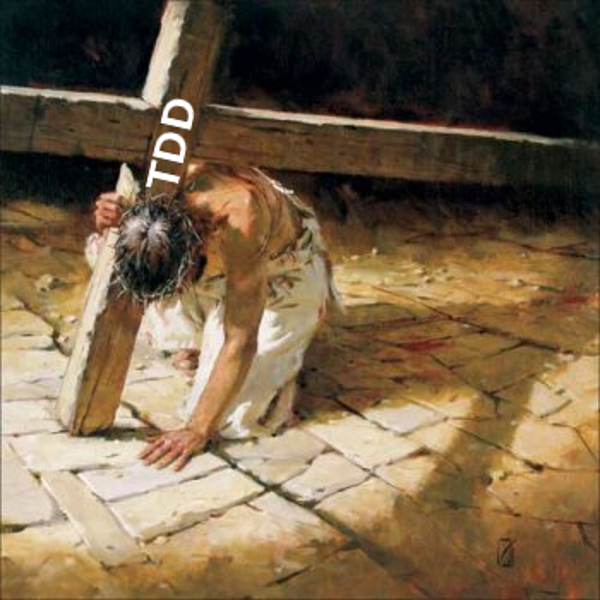
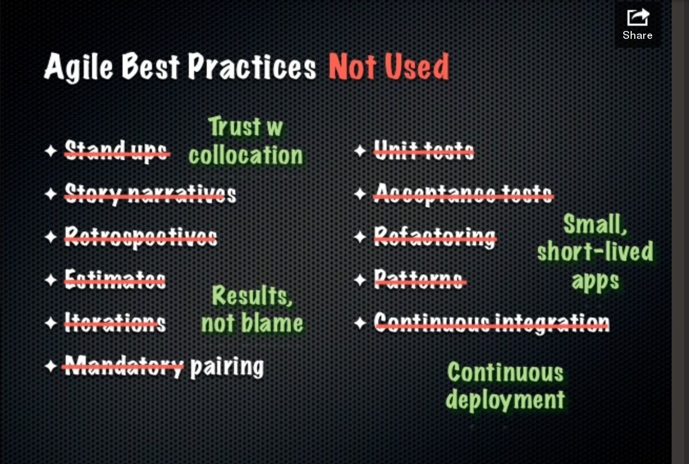
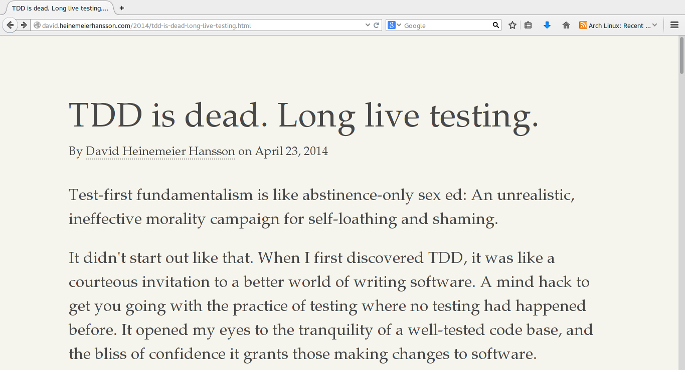

class: center, middle

# .big[ Testing Thoughts ... ]

.footnote[ .violet[ [@f-3r](http://github.com/f-3r)]   .small[ Fernando Martínez ]  ]

???

presentacion personal

por qué el nombre de la charla

Intro:

Incluso sin saber mucho ruby, teniendo sólo un par de años de experiencia como desarrollador (PHP), noté enseguida una diferencia cualitativa en la comunidad de programadores.

Eso fue lo que más me llamó la atención de ruby;

---

class: center, middle

# .blue[Código de Calidad]

???

No fue su sintaxis elegante (de hecho me parecía demasiado compacta y casi ielgible al principio).

No fue la expresividad que es capaz de lograr (no me importaba tener un `for` feo).

No fue la poca cantidad de líneas de código necesarias para programar algo útil.

Lo que me atrapó de ruby fue esa sensación de seguridad al incorporar una librería a mi aplicación para resolver un problema determinado, estaba realmente resolviendo el problema y no comprándome problemas nuevos.

---
class: center, middle

# .yellow[Código de Calidad]

.red[**Certeza**] al incorporar una librería a mi aplicación, de estar realmente resolviendo un problema y no comprándome problemas nuevos.

---
# .violet[La comunidad ruby produce codigo de calidad]

  * Principios de Programación Orientada a Objetos

  * Testing

???

No vamos a hablar de programación orientada a objetos (aunque estaría muy bueno que se haga en algún momento en este espacio)

Uno lee sobre testing y enseguida aparece TDD
algunos super poderes de TDD

---
class: center, middle

# .red[T] .yellow[D] .green[D]

???

## preguntar quién sabe que es TDD

## preguntar quién usa TDD diariamente como metodología

si no saben que es tdd

una forma de programar, cíclica, una metodología

Tiene 3 reglas (según Bob Martin):

1) no se puede agregar nada de código funcional a menos que sea para hacer pasar un test

2) Un test, no se puede escribir mas que lo necesario para que el test falle.

3) no se puede escribir más código que lo mínimamente necesario para que el test que falla pase.

red - green - refactor

---
# .yellow[muchas ventajas!]

* Self-testing code
* Conduce a un buen diseño
  * Desacoplado y cohesivo
  * Código refactorizado, limpio
  * evitar sobre ingeniería
* Suite de pruebas automática
* Seguridad al realizar cambios o refactorizar
* Protección contra defectos
* Detección temprana de errores
* Reemplazo de Documentación

---

# .red[TDD no es fácil]

  * Proceso anti-intuitivo
  * TDD es una técnica, como tal require de tiempo de .violet[práctica]

####  .green[ Pero: ]

  * los beneficios que trae valen la pena el esfuerzo
  * hay que sacrificarse

???

(yo) muy pocas veces logré una programación ágil y fluida.

---
class: center, middle

.crop[]

???

Tanto sacrificio!

# ---> peer programming jesus

---
class: center, middle

.crop[]

---

# .red[TDD no es fácil]

  * Proceso anti-intuitivo
  * require de tiempo de .violet[**práctica**]

???

 **=== corte ===**

luchando por aprender y aplicar tdd bien.

leyendo cuanto artículo encontrara.

investigando

probando

refinando

en fin... en la lucha!

---
class: center, middle

.crop[]

???

tenes una espada re poderosa

pero las manos atadas

es como una cagada

---
class: center, middle

.crop[]

---
class: center, middle

#.violet[ cuando... ]

---
class: center, middle

### .blue[Micro Service Architecture]

.lblue[Fred George]

[Implementing Micro Service Architecture](http://oredev.org/2013/wed-fri-conference/implementing-micro-service-architectures)

<iframe src="//player.vimeo.com/video/79866979" width="500" height="300" webkitallowfullscreen mozallowfullscreen allowfullscreen></iframe>

???

comentar por arriba que es la idea de microservicios

referir a la diapositiva que llamó la atención

---
class: center, middle
### .violet[Micro Services Architecture]

.crop[]

---
class: center, middle

#.red[ W A T  ? ]

---
class: center, middle

---
class: center, middle

.red[**NO**] hacen tests de unidad!

.red[**NO**] hacen tests de aceptación!

.red[**NO**] hacen integración continua!

.red[**NO**] hacen .red[REFACTORING!]

.red[**NO**] usan .red[PATRONES DE DISEÑO!!]

 

.red[**NO**] hacen nada de lo .yellow[consagradamente] considerado .green[BUENO!!]

---
class: center, middle

### .yellow[La frutilla del postre]

.blue[@DHH]

---

 

---

class: center, middle

# .red[ W A A A A A T ? ]

---

class: center, middle

---

class: center, middle

???

¿Qué necesita esa cabeza? un reset.

---
class: center, middle

# .green[ R e s e t ]

???

esto era necesario. Después de la explosion de cabeza

queda un mundo llano,

árido

inhóspito

sin ideas donde guarecerse

pero quedan ruinas a partir de los cuales reconstruir:

* interrogantes

---

No hay una sola forma de hacer las cosas **correctamente**

* .violet[Interrogantes]
  * ¿es importante hacer testing?
  * ¿por qué lo hacemos? ¿para qué?
  * ¿cual es el objetivo de los tests?
  * ¿cómo? ¿cómo se escriben buenos tests?

* .violet[Fundamentalismos cuestionados]
  * El código sin tests es .red[malo]. No es .red[profesional] no testear.
  * Los tests .lblue[son más importantes] que el codigo productivo.
  * TDD produce un .yellow[mejor diseño].

???

Acá es donde empieza el testing de pensamientos.

Son un monton de ideas que no están del todo hiladas.

la idea es que se abra un lugar en la comunidad a poner estos u otros derivados en la mesa, hablarlos, contrastar ideas...

---
class: center, middle

# .violet[¿por qué hacemos testing? ]

---
class: center, middle

Objetivo principal de los tests.

# .green[Confianza]

Lograr que programar deje de ser una cuestión de .yellow[**Fe**].

???

esto es independiente de tdd, tiene que ver sólo con testing

---
## .blue[Faith Driven Development]

 1. programo, programo,  programo,  programo…

 2. Abro el navegador. Hago unos clicks.

 3. Lo que hice no anda!

 4. Debugueo.

 5. (loop until done)

???

despues de 3 o 4 vueltas...

---
## .violet[Faith Driven Development]

 1. programo, programo,  programo,  programo… .small.comment[(Se observa humo saliendo de la cabeza del programador)]

 2. Abro el navegador. Hago unos clicks. .small.comment[(aburridOooOoOoo)]

 3. Lo que hice .red[no ANDAAAAAHHHH!!!]

 4. Debugueo. .small.comment[(con ganas de atravezar el monitor con un hacha)]

 5. (loop until done)

---
## .red[Faith Driven Development]

 6. .green[TERMINE!]
   - Deploy del código nuevo a producción.
   - listo para partir, liquidado, me queda solo el último paso. El más importante de todos:
   me voy a casa pensando:

 7.  .italic[.yellow["**...ojalá** no hay hecho explotar nada…”]]

???

"Ojala" abre al mundo de la FE!

Oremos porque ese último commit haya sido sano!

Es muy distinta la sensación de irse a casa con una test suite en verde

Entonces => Confianza

---
class: center, middle

# .green.big[Confianza]

Lograr que programar deje de ser una cuestión de .yellow[**Fe**].

???

esto es independiente de tdd, tiene que ver sólo con testing

---
class: center, middle
# .yellow[Fundamentalismos]

El código sin tests es .red[malo]. No es .red[profesional]

???

Ya vimos el contra ejemplo de los micro servicios.

El argumento para derribar esto reside en la naturaleza de los tests

---

# .green[Información]

Los tests son, antes que nada, una fuente de información sobre el sistema en desarrollo.

* La ejecución de un test aporta información sobre el sistema

* El test mismo (el código, sin ejecutarlo) aporta información sobre el sistema.

.yellow.foot[¿son la única fuente de información?]

---

# .violet[Fuentes de información]

* Feedback de usuario
* Logs
* La consola
* El debugger
* Code review
* Monitoreo
* Estadisticas

???

micro servicios reemplazan

tests de unidad con monitoreo de servicios
test de aceptación con estadísticas de negocio

---

## .red[Conocimiento]

La información permite construir .blue[conocimiento] sobre el sistema.
Las ventajas más importantes del testing provienen de ese conocimiento.

Conocimiento se construye a partir de una .green[**interpretación**] de la información.

Y Las cuestiones interpretativas son:

* .violet[complejas]
* .lblue[subjetivas]
* .green[determinadas contextualmente]
* .red[determinadas por el observador]

???

Esto es fundamental en **toda** la actividad de **programación**

En cierto sentido acerca a la programación más hacia las ciencias sociales que a las ciencias duras

---
class: center, middle

# .yellow[Fundamentalismos]

.violet[ TDD == buen diseño ] .comment.small[ '#=> true ]

---
class: center, middle

.yellow[ TDD == buen diseño ] .comment.small[ '#=> true ]

* ¿se puede escribir código prolijo, bien diseñado, de calidad sin aplicar TDD?
* ¿se puede escribir código acoplado, de poca calidad, aplicando TDD?

???

Esta es una de las cosas que DHH critica bastante.

¿entonces, de qué depende el buen diseño??

---
class: center, middle

.red[ TDD ] no te lleva a ningún lado.

Uno, programador, toma las decisiones de diseño.

.violet[**Siempre**]

 
 

**Decisiones informadas**
 
.small[(A partir de la información que puede obtener del sistema)]

---

class: center, middle

# .green[Cómo escribir tests .big[**bien**]]

---

.red[Muchos tipos de tests:]

  

* de aislamiento
* de unidad
* funcionales
* de integración
* de aceptación
* de performance
* de regresión
* de tests????

???

cada uno de estos test se escribe de forma diferente

con herramientas diferentes

No hay mucho consenso en qué es un test de unidad por ejemplo.

---

.lblue[Diferentes propósitos:]
  

* Validación .small[(de una implementación con respecto a una especificación)]
* Validar colaboración entre unidades funcionales
* Prevenir introducción de bugs
* Especificar una interfase
* Guiar o derivar el diseño
* Documentación, especificación ejecutable
* Aislamiento
* Velocidad de feedback
* persecución de métricas

???

No hay una relación 1 a 1 con los tipos

---

# .yellow[Cómo escribir tests bien]

Diferentes tipos de tests,
aportan diferente información,
Tienen diferentes propósitos.

 

cómo hacer un **buen** test depende de:

* qué .lblue[**conocimiento**] queremos obtener del sistema
* el .green[**propósito**] que le da origen al test
* cúanto .red[**valor**] que aporta

???

esta parte requiere de mayor investigación, invitados todos!

estaría bueno juntar tests y analizarlos

 

nueva dimensión: valor

todo aquello que aporta valor tiene como contracara un precio

---

# .violet[Los tests no son gratis]

Los tests son **código**. Como tal implica:

 

  * .blue[Hay que escribirlo] .small.comment[(pensarlo, probarlo, corregirlo)]
  * .red[Hay que mantenerlo!]
  * .green[Encima es código acoplado al de la aplicación] .small.comment[(necesita cambios coordinados)]

---

# .red[Balance]

.italic["I get paid for code that works, not for tests, so my philosophy is to test as little as possible to reach a given level of .red[confidence] (I suspect this level of confidence is high compared to industry standards, but that could just be hubris).

If I don’t typically make a kind of mistake (like setting the wrong variables in a constructor), .red[I don’t test for it]."]

.blue.footnote[Kent Beck]

---
# .green[Balance]
 
Algunos factores a balancear:

+ .violet[Cantidad] de tests

+ .violet[Velocidad] de feedback

+ Nivel de .violet[Confianza] deseado

---

## .big[Conclusiones]

* .red[Confianza]
* .green[Balance]
* .violet[Programar es una actividad altamente interpretativa.]
* .yellow[Las recetas mágicas no existen.]

 
* Al final, TDD ¿Está muerto o no?

???

Hay muchos de los beneficios mencionados
No son sólo de TDD, sino que son gracias a una suite de tests automáticos.

confianza:

* refactoring seguro
* Self-testing code
* y sobre todo: **confianza**

balance:
* esta es la manifestación de que nuestra actividad es altamente interpretativa
* siempre pesar: valor sobre costo, proposito

---

## La saga de la muerte de TDD

.blue[ [TDD is dead. Long live testing. - DHH](http://david.heinemeierhansson.com/2014/tdd-is-dead-long-live-testing.html) ]

.green[ [Test-induced design damage - DHH](http://david.heinemeierhansson.com/2014/test-induced-design-damage.html) ]

.violet[ [Slow database test fallacy - DHH](http://david.heinemeierhansson.com/2014/slow-database-test-fallacy.html) ]

.yellow[ [Monogamous TDD - Uncle Bob](http://blog.8thlight.com/uncle-bob/2014/04/25/MonogamousTDD.html) ]

.red[ [Test Induced Design Damage? - Uncle Bob](http://blog.8thlight.com/uncle-bob/2014/05/01/Design-Damage.html) ]

.lblue[ [When TDD doesn’t work. - Uncle Bob](http://blog.8thlight.com/uncle-bob/2014/04/30/When-tdd-does-not-work.html) ]

.violet[ [Professionalism and TDD - Uncle Bob](http://blog.8thlight.com/uncle-bob/2014/05/02/ProfessionalismAndTDD.html) ]

.red[ [RIP TDD - Kent Beck](https://www.facebook.com/notes/kent-beck/rip-tdd/750840194948847) ]

---

## Artículos y Presentaciones

.blue[ [Test First - Bob Martin](http://blog.8thlight.com/uncle-bob/2013/09/23/Test-first.html) ]

.green[ [TDD Costs & Benefits - Gregory Brown ](https://practicingruby.com/articles/tdd-costs-and-benefits) ]

.violet[ [Micro service architecture - Fred George](http://oredev.org/2013/wed-fri-conference/implementing-micro-service-architectures) ]

.lblue[ [Testing Assumptions - Gregory Brown](https://gist.github.com/sandal/2277788)]

.red[ [The benefits of tdd are neither clear nor are they immediately apparent](http://scrumology.com/the-benefits-of-tdd-are-neither-clear-nor-are-they-immediately-apparent/) ]

---
class: center, middle

## .big.violet[Gracias!]
